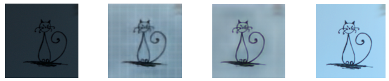
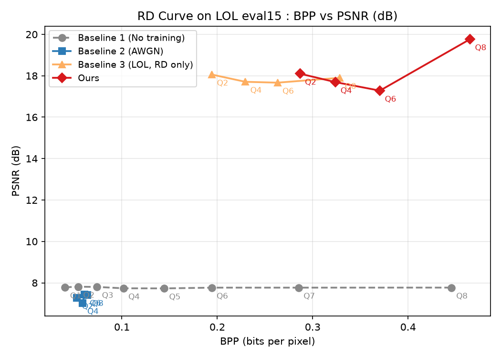
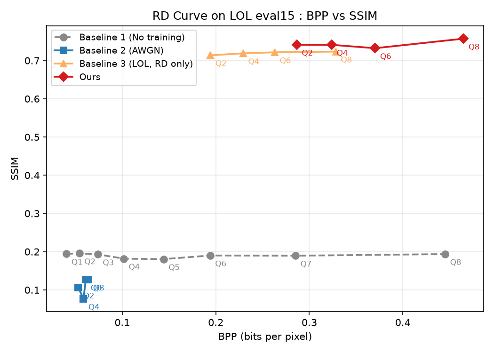

# CUAI_summer_conference_CV_Team4
CUAI 하계 컨퍼런스 CV 4팀

## Lightweight Edge-Preserving Joint Enhancement-Compression Network for Extreme Low-Light Environments
> **CUAI 9기 2026 하계 컨퍼런스 프로젝트**
> 저조도 향상과 압축의 동시 최적화를 위한 경량 딥러닝 코덱

[](https://pytorch.org/)
[](https://interdigitalinc.github.io/CompressAI/)

### Overview
본 프로젝트는 통신망이 열악한 엣지(Edge) 환경(방범용 CCTV, 야간 드론 등)에서 촬영된 **극저조도 영상을 압축과 동시에 밝기 향상시키는 경량 딥러닝 코덱**을 제안합니다.

저조도 영상의 열화는 노이즈만이 아니라 **밝기 자체의 소실**을 동반합니다. 저희는 이 문제를 기존처럼 "노이즈 제거(Denoising)" 관점으로 접근하지 않고, **저조도 향상과 압축의 동시 최적화 문제로 재정의**했습니다. 실제로 인공 노이즈(AWGN) 가정에 기반한 기존 JDC(Joint Denoising and Compression) 방식을 저희 데이터로 재현해본 결과, **학습을 전혀 하지 않은 모델보다도 낮은 성능**(PSNR 7.81→7.28dB, SSIM 0.196→0.106)을 보였습니다. 이는 인공 노이즈 가정이 실제 저조도 환경에 그대로 이전되지 않는다는 도메인 시프트를 정량적으로 보여줍니다.

이를 바탕으로 저희는 실제 저조도-정상조도 쌍으로 직접 학습하고, 여기에 **CBAM(어텐션 모듈)**과 **Edge/TV Loss(윤곽선 보존·아티팩트 억제 손실함수)**를 결합해, 기반 모델과 사실상 동일한 파라미터 크기를 유지하면서 실용적인 화질 개선을 달성했습니다.

<br>

### Problem Statement
사전 학습된 기존 압축 모델(`bmshj2018-hyperprior`)에 극저조도 영상을 그대로 입력했을 때, 다음과 같은 문제가 발생함을 확인했습니다.
1. **밝기 소실 미해결:** 정상 조도 기준으로 설계된 모델이라 어두운 영역의 텍스처와 노이즈를 구조적으로 구분하지 못함.
2. **엣지·윤곽선 뭉개짐(Over-smoothing):** 픽셀 단위 손실(MSE)만으로는 저비트레이트에서 윤곽선이 흐릿하게 복원됨.
3. **노이즈로 인한 비트레이트 낭비:** 인공 노이즈 가정으로 학습한 모델은 신호로 보존해야 할 미세 구조까지 노이즈로 간주해 제거함 — 오히려 학습하지 않은 모델보다 성능이 낮음.

<br>

### Proposed Method

#### 1. Data-Level: 저조도-정상조도 실측 페어 학습
* **Dataset:** LOL (Low-Light) Dataset — our485(학습 485쌍) / eval15(평가 15쌍)
* 인공 노이즈 합성이 아닌 실제 카메라로 촬영된 저조도-정상조도 페어로 직접 미세조정(fine-tuning)하여, 밝기 복원과 압축을 하나의 목적함수 안에서 동시 학습.

#### 2. Architecture-Level: Attention Module (CBAM)
* CompressAI `bmshj2018_hyperprior`의 **디코더 입력단**(엔트로피 복호 직후)에 CBAM(채널 주의 + 공간 주의)을 잔차 형태로 결합: `ŷ' = ŷ + α·CBAM(ŷ)`
* 학습 가능한 스칼라 α(초기값 0.01)로 warm-up하여 사전학습 가중치를 훼손하지 않음.
* 인코더 위치도 검토했으나, 디코더 대비 유의미한 개선이 없고 출력이 불안정해져 디코더로 최종 결정.

#### 3. Loss-Level: Edge-Preserving & Anti-Artifact Loss
* 기존 Rate-Distortion Loss(BPP + MSE)만으로는 저비트레이트에서 윤곽선이 뭉개짐.
* **Sobel 기반 Edge Loss(L1)**로 엣지 윤곽선의 선명도를 보존하고, **TV Loss**로 압축 특유의 체커보드 아티팩트를 억제.
* `L = R_bpp + λ·255²·MSE + β·Edge Loss + γ·TV Loss`, β=20·γ=40 (그리드 서치로 결정)

<br>

### Results

**정성적 비교**



*왼쪽부터 원본(저조도) → Baseline 3 → Ours → 정답(High-Light)*

**정량적 비교 (RD Curve)**

<p align="center">
  
  
</p>

| 모델 | BPP | PSNR (dB) | SSIM |
| :---: | :---: | :---: | :---: |
| Baseline 1 (순정 CompressAI, 학습 없음) | 0.054 | 7.81 | 0.196 |
| Baseline 2 (AWGN 기반 JDC) | 0.053 | 7.28 | 0.106 |
| Baseline 3 (LOL 실측 학습, RD Loss만) | 0.194 | 18.06 | 0.714 |
| **Ours (CBAM + Edge/TV Loss)** | 0.287 | 18.10 | **0.741** |

*(quality index 2 기준, LOL eval15)*

- **도메인 시프트 확인:** AWGN 학습(Baseline 2)이 학습하지 않은 모델(Baseline 1)보다도 낮은 성능을 보임 — 인공 노이즈 가정이 실제 저조도 환경에 이전되지 않음을 실증.
- **SSIM 전 구간 개선:** 전 quality index(2·4·6·8)에서 Baseline 3 대비 SSIM +0.011~+0.034 일관되게 개선.
- **동일 비트레이트 비교 우위:** 저희 모델(Q2, 0.287BPP)이 Baseline 3의 최고품질 지점(Q8, 0.328BPP) 대비 **12.7% 적은 비트로 PSNR +0.20dB, SSIM +0.018** 우위.
- **경량성 유지:** 파라미터 5.08M ~ 11.83M(quality index별)로 기반 모델과 사실상 동일 — CBAM 추가분은 전체의 0.1% 수준. 최신 SOTA(TCM 45 ~ 77M, Joint-IC-LL ~30M) 대비 1/4 이하 크기.

<br>

### Limitations & Future Work
- **비트레이트 증가:** 동일 quality index에서 Baseline 3 대비 비트레이트가 40~48% 높음. Edge Loss가 고주파 성분을 유지하려다 엔트로피가 증가한 결과로 분석 — 압축률에 비례한 β·γ 동적 스케일링으로 완화 예정.
- **PSNR 비단조성:** β·γ뿐 아니라 λ까지 전 구간 동일값(quality index 2 기준)으로 고정한 데서 기인 — quality index별 λ 재적용 재학습이 다음 단계로 설계됨.
- **구성 요소별 Ablation 미완료:** CBAM·Edge Loss·TV Loss 각각의 개별 기여도는 아직 분리 검증하지 못함 — 하나씩 제거하는 3개 추가 실험으로 검증 예정.
- **단일 데이터셋 검증:** LOL eval15(15장)로만 검증했으며, SID·SMID 등 다른 저조도 데이터셋으로의 일반화는 미검증.

<br>

## 🛠️ 개발 환경 및 설치 (Prerequisites & Installation)

```bash
# 1. 가상환경 생성 및 활성화 (선택)
conda create -n neural_comp python=3.10
conda activate neural_comp

# 2. 필수 라이브러리 설치
pip install torch torchvision
pip install compressai
pip install matplotlib numpy opencv-python
```

<br>

## 📄 Documentation
- [Short Paper](docs/shortpaper.pdf)
- [Poster](docs/poster.pdf)

<br>

## 👥 Team
- 인선우 (전자전기공학부) — Data Preprocessing, Loss Function 커스텀, Evaluation & Visualization
- 노재혁 (AI학과) — CompressAI Architecture 분석, CBAM 결합, Training Pipeline 구축

<br>

## 📝 License
This project is licensed under the MIT License - see the LICENSE file for details.

## 🙏 Acknowledgments
본 프로젝트는 중앙대학교 인공지능 학회 CUAI 9기 2026 하계 컨퍼런스의 일환으로 진행되었습니다.

Base code is built upon [CompressAI](https://interdigitalinc.github.io/CompressAI/).
